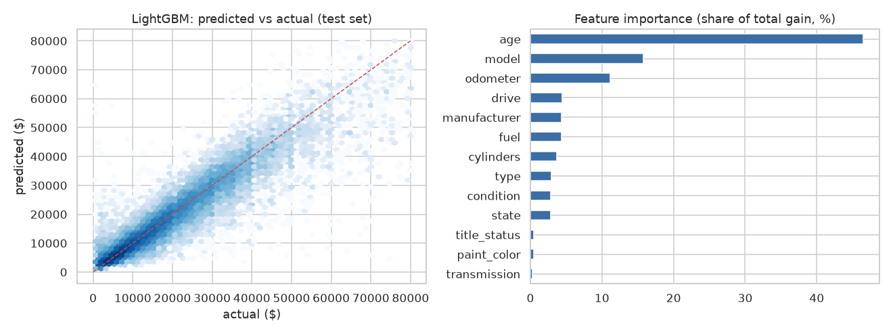
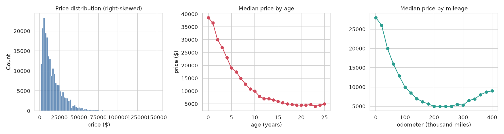

# Used-Car Price Prediction (Craigslist, 426k listings)

Predicting the asking price of a used car from its listing: make, model, age,
mileage, condition and so on. Uses 426,880 US Craigslist listings scraped in
April–May 2021.

Data Analytics project, PES University (5th semester, 2021), by
**Mayuravarsha P, Vedant Mantri and Pranav Mekal Mahesh**. Revised in 2026
(see [what changed](#what-changed-from-the-course-version)).



## Results

Held-out test set (20 %, 41,651 cars). All models predict log(price).

| Model | R² (log price) | MAE | Median % error |
|---|---:|---:|---:|
| **LightGBM, native categoricals** | **0.853** | **$2,716** | **13.4 %** |
| Histogram gradient boosting (target-encoded model) | 0.845 | $2,952 | 14.7 % |
| Random forest | 0.802 | $3,372 | 16.6 % |
| Ridge regression, one-hot | 0.781 | $3,635 | 17.1 % |
| Baseline: median price for the same make and year | 0.565 | $5,728 | 30.2 % |

* **Age** is the strongest predictor (46 % of LightGBM's gain), followed
  by the specific **model** (16 %) and **mileage** (11 %). Cars lose about
  **12 % of their value per year** over their first 15 years.
* Relative errors are largest for cheap cars: 23 % median error under
  $5,000, against 10–13 % above $20,000. Damage and condition matter most
  at the bottom of the market, and the structured fields capture them poorly.



## Data cleaning

| Problem in the raw data | Share | Handling |
|---|---:|---|
| Price under $1,000 (mostly "$0, call for price") | 10.9 % | removed |
| Absurd prices (up to $3.7 billion) | < 0.1 % | removed above $150,000 |
| Same car re-posted (VIN seen before) | 34.6 % | one row per VIN |
| Odometer 0 or over 400,000 miles | 0.4 % | removed |
| `size` column 72 % missing | | dropped |
| Other missing categoricals | up to 41 % | kept as an explicit `"missing"` level |

That leaves 208,254 listings. Model names are reduced to their first two
words (`"silverado 1500 crew cab lt"` → `"silverado 1500"`), about 10,000
distinct values.

## What changed from the course version

The original notebook (kept as
[`notebooks/original_used_cars.ipynb`](notebooks/original_used_cars.ipynb))
reported **R² = −55 and RMSE = $88 million** for its baseline. Its best
model still had a negative R², i.e. it was worse than predicting the mean.
The causes, each reproduced in the new notebook:

1. **Prices were never cleaned.** A handful of $3-billion listings
   dominated every squared-error metric.
2. **The grid search picked the worst parameters.** Scoring with
   `make_scorer(mean_squared_error)` tells `GridSearchCV` that higher error
   is better. On a decision tree it chose `max_depth=2` instead of 8.
3. **Train/test leakage from re-posted cars.** Keeping duplicates raises
   the test R² from 0.853 to 0.878 without any real improvement.
4. `StratifiedKFold` was applied to a continuous target, and only the last
   fold's split was kept. `X[:, :14]` silently dropped columns, and 20,000
   model names were label-encoded into one integer.
5. The year filter dropped 2021 cars as "future" years, even though the
   listings were posted in 2021.

## Run it

```bash
pip install -r requirements.txt
pytest                                   # uses the bundled 30k-row sample

# full data: pull the LFS file (1.4 GB) or point to a copy
git lfs pull                             # -> data/vehicles.csv
cd notebooks && PYTHONPATH=.. jupyter notebook used_car_prices.ipynb
# or: VEHICLES_CSV=/path/to/vehicles.csv
```

## Layout

```
usedcars/data.py        loading + cleaning rules
usedcars/models.py      baseline, ridge, random forest, HGB, LightGBM, metrics
usedcars/experiment.py  train/test split and model comparison
notebooks/used_car_prices.ipynb     revised analysis (executed on the full data)
notebooks/original_used_cars.ipynb  2021 course notebook
data/vehicles.csv                   full dataset (Git LFS)
data/vehicles_sample.csv.gz         30,000 raw rows for tests / quick runs
docs/                   final report and literature review (PDF)
figures/                charts
tests/                  pytest suite, run in GitHub Actions
```

Dataset: [Austin Reese, *Used Cars Dataset*, Kaggle](https://www.kaggle.com/datasets/austinreese/craigslist-carstrucks-data).
